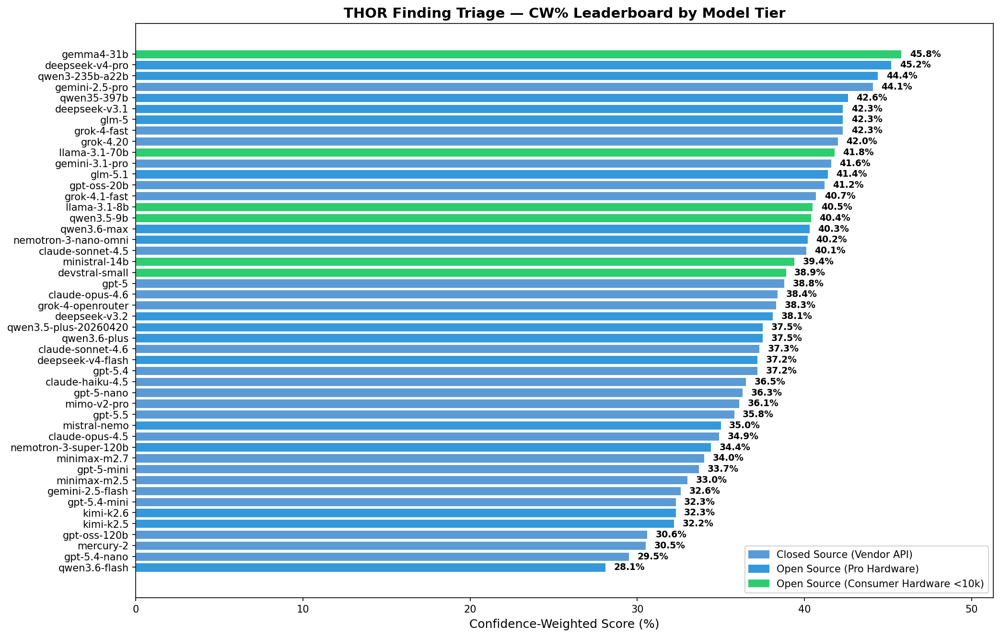
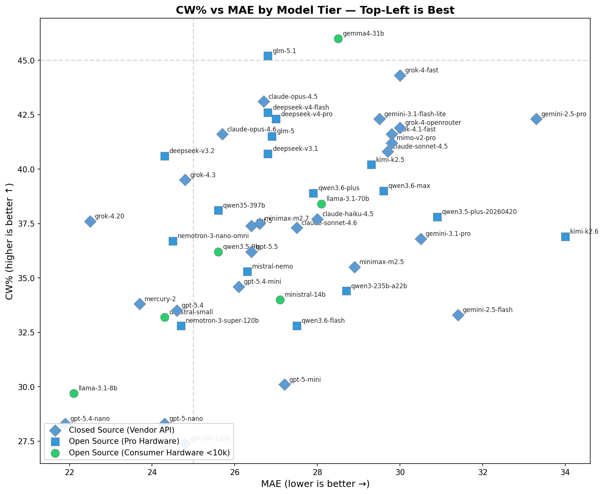
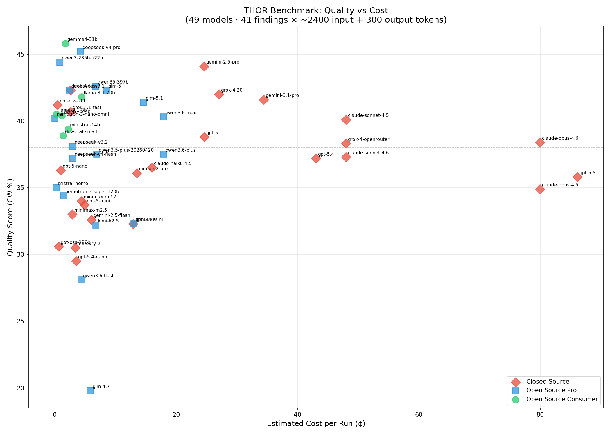
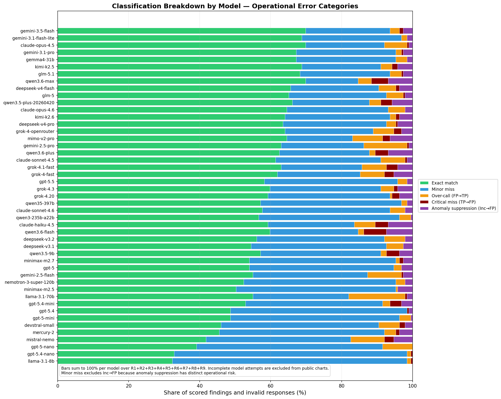

# THOR AI Benchmarks

> Benchmarking LLM models on THOR finding triage quality against human expert ground truth.

This repository contains the public benchmark results. The scoring methodology, ground truth data, and scoring scripts remain in a private repository to prevent gaming.

## What We Benchmark

We evaluate how well LLMs can **triage THOR findings** — the security alerts produced by [THOR](https://nextron-systems.com/thor/), Nextron Systems' forensic scanner.

### What Are THOR Findings?

THOR scans endpoints (Windows, Linux, macOS) for indicators of compromise. When it detects something suspicious, it produces a **finding** — an alert that includes:

- **Files** matching obfuscation or exploit signatures (packed executables, webshells, exploit tools)
- **Suspicious registry or startup entries** (persistence mechanisms, hijacked services)
- **Cache artifacts** showing execution of malware or attacker tools (Amcache, Shimcache, SRUM)
- **Process anomalies** (suspicious command lines, injected DLLs, credential-dumping tools)
- **Network indicators** (C2 callbacks, suspicious DNS, beacon patterns)
- **Rootkit or driver signatures** (LSA SSP injection, filter drivers)

Each finding gets an initial severity score and classification from THOR's rule engine, but the critical question for analysts is: **Is this a genuine threat (true positive) or a benign match (false positive)?**

### The Triage Problem

In real incident response, an analyst must decide for each finding:

| Classification | Meaning |
|---|---|
| **True Positive (TP)** | Genuine security threat — requires immediate investigation |
| **Inconclusive (Inc)** | Cannot clearly determine — needs further manual review |
| **False Positive (FP)** | Benign match — no security relevance |

An LLM that flags a real threat as FP **misses a real attack**. An LLM that calls everything TP **wastes analyst time**. The best models balance precision and recall — confidently calling TPs as TP and FPs as FP, while using "inconclusive" only when genuinely uncertain.

### Test Data

We used **multiple real THOR scan reports** from both Windows and Linux systems, containing a diverse set of findings — from confirmed malware and attacker tools to benign software triggers. Ground truth classifications were assigned by a human expert (Florian Roth, THOR's creator).

## Scoring Methodology

We score each model's classifications against human expert ground truth using a **Confidence-Weighted (CW)** system that accounts for both accuracy and confidence.

### Why Confidence Matters

Two models that both classify a finding correctly are not equal if one is 95% confident and the other is 50%. In security triage, **high confidence in correct answers is valuable** — it lets analysts trust the assessment and move on. But **high confidence in wrong answers is dangerous** — it actively misleads. Our scoring reflects this.

### Ordinal Classification Scale

Classifications are ordered by severity: **FP (0) — Inc (1) — TP (2)**

This creates a natural distance between categories:

| Classification Pair | Distance | Type |
|---|---|---|
| Exact match (e.g., both TP) | 0 | Correct |
| One step apart (e.g., TP→Inc, FP→Inc) | 1 | Minor miss |
| Two steps apart (e.g., TP→FP, FP→TP) | 2 | Hard miss |

### Penalty Structure

| Error Type | Example | CW Penalty | Rationale |
|---|---|---|---|
| **Exact match** | Both say TP | +1.0 to +2.0 (reward) | Correct, scaled by confidence |
| **Minor miss** | GT=TP, model=Inc | 0.0 to +0.5 | Small penalty — close, but not decisive |
| **Over-call** (FP→TP) | Benign matched, model says TP | −0.25 to −0.5 | Moderate penalty — wastes analyst time |
| **Critical miss** (TP→FP) | Real threat, model says FP | −0.75 to −1.5 | **Severe penalty** — missed a real attack |

**Why TP→FP is penalized hardest:** In security operations, a false negative (missed threat) is far more dangerous than a false positive (over-investigation). An attacker that goes undetected can cause catastrophic damage. Over-investigation costs time, but doesn't let attackers stay inside the network.

### CW Formula Detail

Confidence is dampened from 0–100% to 0.5–1.0 to prevent models from gaming by always answering with low confidence:

```
d = 0.5 + 0.5 × (confidence / 100)

Distance 0 (exact):   1.0 + d     →  range 1.5 – 2.0
Distance 1 (minor):   0.5 − 0.5d  →  range 0.0 – 0.5
Distance 2 (over):   −0.5 × d     →  range −0.5 – −0.25
Distance 2 (missed): −1.5 × d     →  range −1.5 – −0.75
```

CW% = (sum of all finding scores) / (N × 2.0) × 100

### Error Handling

If a model fails to produce a valid classification for a finding (LLM error, timeout, unparsable response), that finding is **excluded from scoring** rather than treated as FP. Models with **2 or more errors** are flagged as incomplete (⚠) and ranked at the bottom of the leaderboard — a model that cannot reliably process all findings is unsuitable for production triage.

## Latest Results

### CW% Leaderboard (Confidence-Weighted Score)

Higher is better. Rewards confident correct answers, punishes confident wrong answers.



### CW% vs MAE

Top-left = best (high CW%, low MAE).



### Quality vs Cost

Which models deliver the best triage quality for the money? Cost estimated per full benchmark run (41 findings, ~2400 input + 250–400 output tokens per call) using OpenRouter pricing.



### Classification Accuracy Breakdown

Green = exact match, blue = one step off (e.g., TP↔Inc), yellow = over-call (FP→TP), red = missed threat (TP→FP).



## Full Data

See [combined/leaderboard.csv](combined/leaderboard.csv) for the complete sortable data.

### Key Terms

| Abbreviation | Meaning |
|---|---|
| **CW%** | Confidence-Weighted Score — primary ranking metric |
| **Ord%** | Ordinal Accuracy — simple exact/near/miss scoring |
| **MAE** | Mean Absolute Error — average |AI score − Human score| |
| **RMSE** | Root Mean Square Error — penalizes large errors |
| **TP** | True Positive — genuine security finding |
| **Inc** | Inconclusive — cannot definitively classify |
| **FP** | False Positive — not a genuine security finding |
| **Ex** | Exact classification matches |
| **Mi** | Minor misses (one category off) |
| **Ha** | Hard misses (two categories off) |
| **Err** | LLM errors (no valid classification produced) |

## Related

- **Mjolnir AI** — [github.com/Nextron-Labs/mjolnir-ai](https://github.com/Nextron-Labs/mjolnir-ai) — the AI triage tool
- **THOR** — [nextron-systems.com/thor](https://nextron-systems.com/thor/) — the forensic scanner

## License

Benchmark results © Nextron Systems.