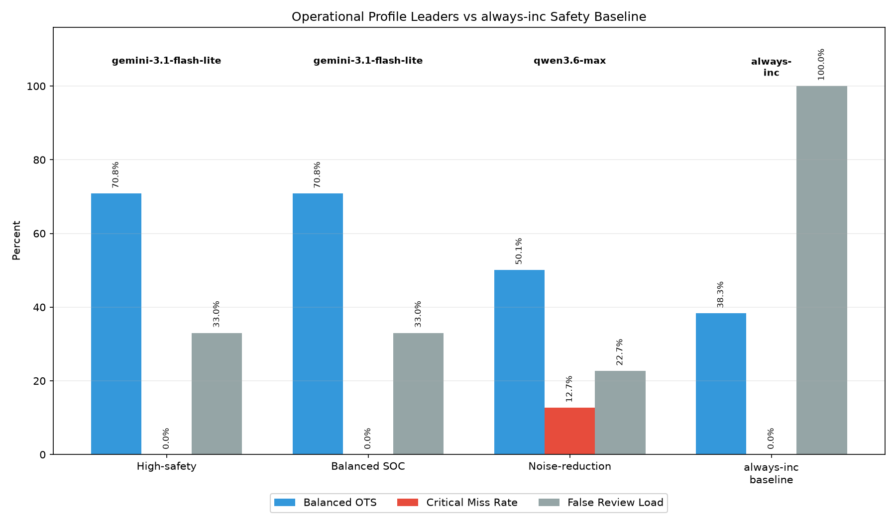
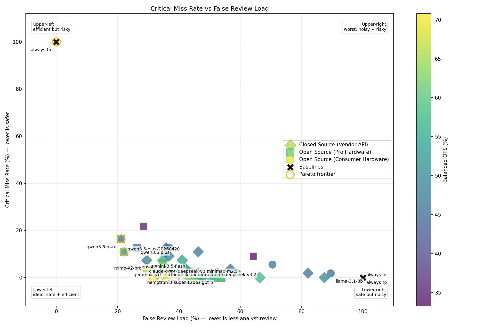
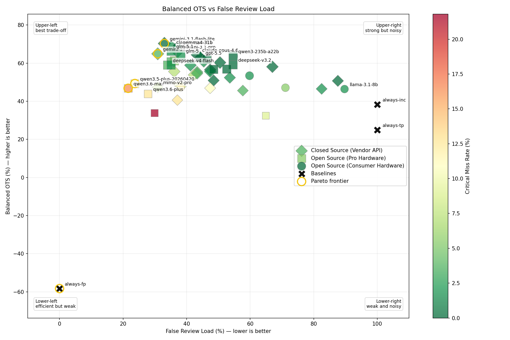
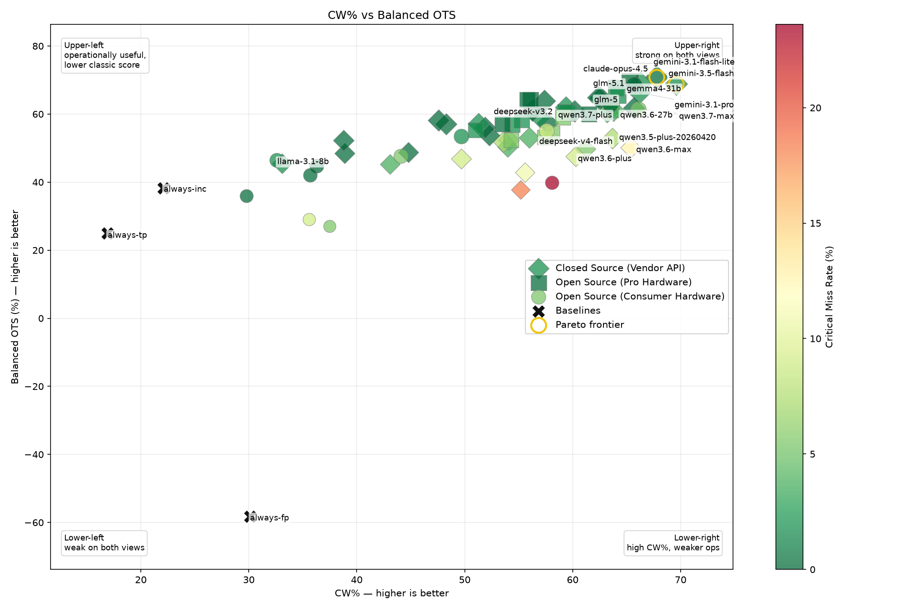
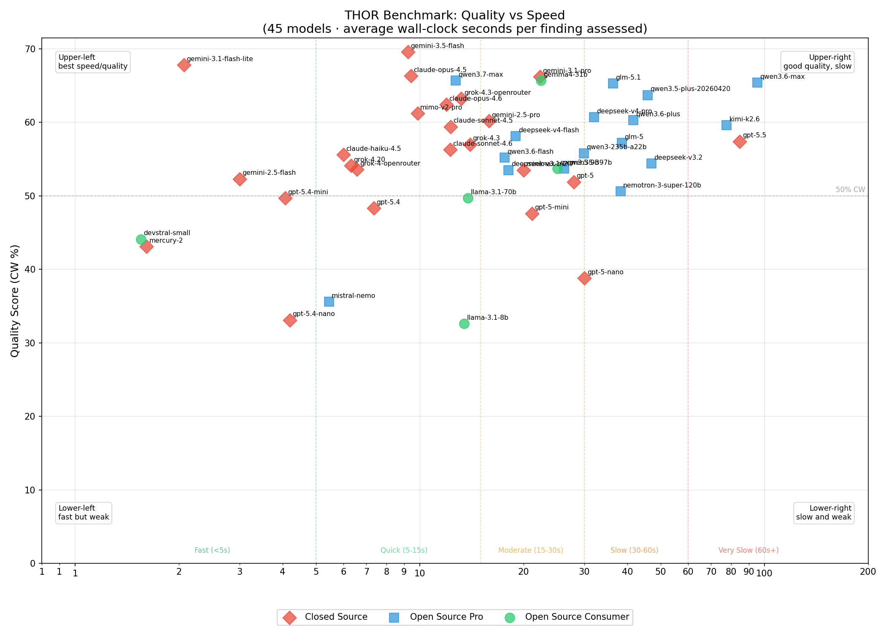

# THOR AI Benchmarks

This benchmark evaluates LLMs on THOR finding triage. It focuses on security event and forensic finding assessment, not generic reasoning, coding, or vulnerability research.

The current public result set covers **48 models**, **7 THOR reports**, and **154 expert-classified findings**. Models are compared against human expert ground truth and are evaluated on both classification quality and operational usefulness.

## Current Result Summary

These are **current profile leaders under the selected constraints**, not universal winners.

| Use case | Suggested model | Why |
|---|---|---|
| High-safety triage | `llama-3.1-8b` | Lowest critical miss rate among useful models, beats `always-inc` on Balanced OTS, but still has high review load |
| Balanced SOC triage | `deepseek-v3.2` | Under these constraints, currently the best balance between safety and review reduction in this data set |
| Noise reduction / high-volume triage | `deepseek-v4-flash` | Lowest false review load among acceptable models, but with higher miss risk than the high-safety profile |

There is no single best model. The useful choice depends on whether the deployment optimizes for missed-incident avoidance, balanced SOC triage, review-load reduction, cost, or latency.

## Reader Guide

Start with the operational charts, not the CW% leaderboard. Use Critical Miss Rate vs False Review Load to understand safety vs workload. Use Balanced OTS vs False Review Load to see operational usefulness. Use CW% vs Balanced OTS to see where classic classification quality and operational triage quality diverge. Then use cost and speed charts only after the safety profile is acceptable.

Quick metric orientation:

- **Critical Miss Rate**: how often a true positive is suppressed as false positive (`TP→FP`). Lower is better.
- **False Review Load**: how many false positives still reach analysts as `Inc` or `TP`. Lower is less noisy.
- **Balanced OTS**: operational triage utility across `FP`, `Inc`, and `TP`, balanced so one class does not dominate. Higher is better.
- **CW%**: classic confidence-weighted benchmark score. Higher is better, but it does not fully capture operational risk.

Useful shorthand:

- **Safe but noisy**: low Critical Miss Rate, high False Review Load. The model avoids hiding incidents but still sends too much to review.
- **Efficient but risky**: low False Review Load, high Critical Miss Rate. The model reduces analyst workload by suppressing too much, including real threats.
- **Good exact scoring but weak operational profile**: high CW%, but too many `TP→FP`, `Inc→FP`, or false escalations for the intended workflow.

Baselines are included to anchor the charts. They are intentionally naive strategies, not deployment recommendations.

## Main Decision Charts

The first charts are decision charts: they are meant to help pick a model for an operational profile, not just rank models by one score. Scatter plots label profile leaders, baselines, Pareto-frontier models, top metric performers, and models discussed in the README. Full-labeled appendix versions are also generated for detailed inspection.

### 1. Operational Profile Summary

This chart puts the three operational profile leaders next to the `always-inc` safety baseline. Each group shows Balanced OTS, Critical Miss Rate, and False Review Load with value labels, so the trade-off is visible without reading the full tables.

`llama-3.1-8b` is the high-safety profile leader under these constraints, but it still has high review load. `deepseek-v3.2` is the balanced profile leader under the current constraints. `deepseek-v4-flash` reduces review load strongly, but has higher miss risk. `always-inc` is a safety reference, not a useful triage model.

### 2. Critical Miss Rate vs False Review Load

**Axes:** x-axis = False Review Load (lower is better); y-axis = Critical Miss Rate (lower is better).

### How to read this chart

- Upper-left: efficient but risky — low review load, but too many true positives are suppressed
- Upper-right: worst area — high review load and high miss risk
- Lower-left: ideal area — few missed true positives and low unnecessary review load
- Lower-right: safe but noisy — few missed true positives, but too many false positives still go to review

This is one of the most important operational charts. A model in the lower-left would reduce analyst workload without hiding real incidents. Models near `always-inc` are safe but do not reduce enough noise. Models far left but high on the y-axis reduce workload at the cost of missing too many real threats.

The current data set does not contain a perfect lower-left model. `llama-3.1-8b` sits closer to the safe/noisy area, while `deepseek-v4-flash` moves left toward lower review load but upward toward more miss risk.

Full-labeled detail chart: [critical-miss-vs-false-review-full-labeled.png](charts/critical-miss-vs-false-review-full-labeled.png)

### 3. Balanced OTS vs False Review Load

**Axes:** x-axis = False Review Load (lower is better); y-axis = Balanced OTS (higher is better).

### How to read this chart

- Upper-left: best operational trade-off — high operational score and low review load
- Upper-right: safe/strong but noisy — high score, but still sends many FPs to review
- Lower-left: efficient but weak — reduces review load but loses too much operational quality
- Lower-right: weak and noisy — poor operational score and high review load

Balanced OTS rewards operationally safe decisions across FP, Inc and TP classes. It should not be read without False Review Load. A model that sends everything to review can look safe, but it is not useful as a triage filter.

`always-inc` illustrates the noisy-safe baseline: strong safety, but 100% false review load. `deepseek-v3.2` is the current balanced SOC profile leader because it stays close to that operational score while reducing review load substantially.

Full-labeled detail chart: [balanced-ots-vs-false-review-full-labeled.png](charts/balanced-ots-vs-false-review-full-labeled.png)

### 4. CW% vs Balanced OTS

**Axes:** x-axis = CW% (higher is better); y-axis = Balanced OTS (higher is better).

### How to read this chart

- Upper-left: operationally safer/useful, but weaker exact classification score
- Upper-right: strong on both classic scoring and operational scoring
- Lower-left: weak on both views
- Lower-right: good classic classification score, but weaker operational behavior

This chart shows why CW% alone is not enough. CW% rewards confidence-weighted closeness to the expert answer, while Balanced OTS emphasizes operational consequences. A model can look strong by CW% while still having too many critical misses or too much false escalation for a specific SOC use case.

The top CW% models are useful to inspect, but they are not automatically the safest deployment choices. For example, a model can receive a respectable CW% by classifying many benign findings correctly while still being unacceptable if it suppresses too many true positives or review-worthy anomalies. The operational profile leaders are selected by constraints, not by CW% alone.

Full-labeled detail chart: [cw-vs-balanced-ots-full-labeled.png](charts/cw-vs-balanced-ots-full-labeled.png)

### 5. Quality vs Cost

**Axes:** x-axis = estimated cost per benchmark run (lower is better); y-axis = CW% quality score (higher is better).

### How to read this chart

- Upper-left: best cost/quality area — higher CW% at lower estimated cost
- Upper-right: strong but expensive — useful only if the quality gain justifies cost
- Lower-left: cheap but weaker — low cost, but lower benchmark quality
- Lower-right: poor trade-off — lower quality and higher cost

This chart estimates benchmark-run cost from observed token usage and model pricing. This chart is useful only after safety metrics are acceptable. A cheap model with high Critical Miss Rate is not a good production choice just because it is cheap.

### 6. Quality vs Speed

**Axes:** x-axis = average seconds per event (lower is better); y-axis = CW% quality score (higher is better).

### How to read this chart

- Upper-left: best speed/quality area — higher CW% with low per-finding latency
- Upper-right: high quality but slow — may fit batch review, not fast triage
- Lower-left: fast but weaker — useful only if quality is sufficient for the use case
- Lower-right: poor trade-off — slower and lower quality

This chart compares quality against average seconds per event and matters for high-volume triage. Speed is useful only if Critical Miss Rate and False Review Load are acceptable for the workflow. A fast model with low review load but too many critical misses is efficient but risky, not production-ready.

### 7. Classification Breakdown

This chart shows how each model’s decisions break down. Green is exact agreement with expert ground truth. Blue means the model was one step away. Orange/yellow means the model over-escalated benign findings. Dark red is the most dangerous case: a true positive classified as false positive. Red/purple marks review-worthy anomalies that were suppressed as false positives. Grey means the model failed to return a valid classification.

### How to read this chart

- More green is better.
- Some blue can be acceptable, especially `TP→Inc`, because the finding still reaches a human.
- Orange/yellow means analyst workload increases.
- Dark red is the most dangerous segment and should be minimized.
- Red/purple means relevant anomalies disappear and should also be minimized.
- Grey indicates reliability problems.

The stacked bars sum to 100% for each model over scored findings and invalid responses. Missing/unscored findings are not mixed into the stacked percentages. For absolute counts of only the operational error classes, see [operational-error-breakdown.png](charts/operational-error-breakdown.png).

### 8. CW% Leaderboard

The CW% leaderboard is retained as a compact ranking of confidence-weighted score quality. It should not be used as the only model-selection metric. Operational selection should consider Critical Miss Rate, Threat Capture Rate, False Review Load, Balanced OTS, cost, and speed.

## Baseline Reference

These rows are deliberately naive control strategies. They are included to calibrate the metrics, not because anyone should deploy them.

| Strategy | CW% | Balanced OTS | Critical Miss | Threat Capture | False Review | False Escalation | Cost/Run |
|---|---:|---:|---:|---:|---:|---:|---:|
| `always-fp` | 26.9% | -58.3% | 100.0% | 0.0% | 0.0% | 0.0% | $0.00 |
| `always-inc` | 22.1% | 38.3% | 0.0% | 100.0% | 100.0% | 0.0% | $0.00 |
| `always-tp` | 19.2% | 25.0% | 0.0% | 100.0% | 100.0% | 100.0% | $0.00 |

Baseline strategies are references, not recommendations:

- `always-fp` is the dangerous “suppress everything” baseline. It creates no review load but misses every true positive.
- `always-inc` is the safe but operationally weak “send everything to review” baseline. It has zero critical misses but provides no noise reduction.
- `always-tp` is the noisy “escalate everything” baseline. It avoids misses but creates maximum false escalation.

Naive baselines can appear strong on individual metrics, especially safety metrics, but they are not useful triage strategies.

## Operational Profiles

### Profile 1: High-Safety

**Use case:** Environments where missing a real incident is unacceptable or very costly, such as critical infrastructure, high-value targets, or highly regulated environments.

**Requirements:**

- Critical Miss Rate ≤ 5%
- Threat Capture Rate ≥ 95%
- False Review Load < 100%

**Ranking rule:** Balanced OTS descending, then False Review Load ascending.

| # | Model | CW% | BalOTS | CritMiss | ThreatCap | FalseRev | FalseEsc | Cost/Run | AvgTime |
|---:|---|---:|---:|---:|---:|---:|---:|---:|---:|
| 1 | `llama-3.1-8b` | 28.0% | 40.0% | 2.1% | 97.9% | 88.2% | 6.6% | $0.00 | 12.65s |
| 2 | `gpt-5-nano` | 27.7% | 35.9% | 2.1% | 97.9% | 90.8% | 18.4% | $0.12 | 31.26s |

**Matched:** 2 / 48 models.

**Interpretation:** Under these constraints, `llama-3.1-8b` is the current profile leader. It is one of the few useful models with near-zero critical miss behavior and it beats `always-inc` on Balanced OTS, but the review load remains high.

### Profile 2: Balanced SOC

**Use case:** General SOC operations where both safety and analyst workload matter.

**Requirements:**

- Critical Miss Rate ≤ 15%
- Threat Capture Rate ≥ 85%
- False Review Load ≤ 75%

**Ranking rule:** Balanced OTS descending.

| # | Model | CW% | BalOTS | CritMiss | ThreatCap | FalseRev | FalseEsc | Cost/Run | AvgTime |
|---:|---|---:|---:|---:|---:|---:|---:|---:|---:|
| 1 | `deepseek-v3.2` | 38.8% | 37.4% | 14.6% | 85.4% | 61.8% | 14.5% | $0.32 | 73.28s |
| 2 | `nemotron-3-nano-omni` | 35.2% | 33.1% | 14.6% | 85.4% | 69.3% | 18.7% | $0.00 | 47.19s |
| 3 | `llama-3.1-70b` | 36.9% | 30.5% | 14.6% | 85.4% | 67.1% | 31.6% | $0.00 | 13.93s |
| 4 | `qwen3-235b-a22b` | 33.0% | 26.8% | 12.5% | 87.5% | 65.8% | 14.5% | $0.00 | 32.24s |
| 5 | `minimax-m2.5` | 32.9% | 22.0% | 14.6% | 85.4% | 59.2% | 10.5% | $0.16 | 20.07s |
| 6 | `gpt-oss-120b` | 31.3% | 21.6% | 12.8% | 87.2% | 66.7% | 4.2% | $0.00 | 16.80s |

**Matched:** 6 / 48 models.

**Interpretation:** Under these constraints, `deepseek-v3.2` currently provides the best balance in this data set. It nearly matches the `always-inc` Balanced OTS baseline while reducing review load by about 38 percentage points.

### Profile 3: Noise-Reduction / High-Volume Triage

**Use case:** High-volume alert or finding triage where reducing analyst review load is a priority and some miss risk is accepted.

**Requirements:**

- False Review Load ≤ 55%
- Critical Miss Rate ≤ 20%
- Balanced OTS > 0

**Ranking rule:** False Review Load ascending, then Balanced OTS descending.

| # | Model | CW% | BalOTS | CritMiss | ThreatCap | FalseRev | FalseEsc | Cost/Run | AvgTime |
|---:|---|---:|---:|---:|---:|---:|---:|---:|---:|
| 1 | `deepseek-v4-flash` | 40.9% | 26.2% | 16.7% | 83.3% | 48.7% | 19.7% | $0.10 | 24.31s |
| 2 | `gemma4-31b` | 40.6% | 27.1% | 18.8% | 81.2% | 52.6% | 13.2% | $0.00 | 17.21s |
| 3 | `grok-4.20` | 36.0% | 22.9% | 18.8% | 81.2% | 52.6% | 9.2% | $2.23 | 9.39s |

**Matched:** 3 / 48 models.

**Interpretation:** Under these constraints, `deepseek-v4-flash` is the current review-load reduction leader. It cuts review load sharply compared with `always-inc`, but its miss risk is too high for high-safety use cases.

## What We Benchmark

A **THOR finding** is a security-relevant detection or forensic observation produced by THOR. It can represent a suspicious file, registry artifact, persistence mechanism, process relationship, network indicator, toolmark, anomaly, or other investigation-relevant signal.

Each model receives the same enriched THOR finding context and must classify the finding as:

- `FP` — False Positive
- `Inc` — Inconclusive
- `TP` — True Positive

Operationally, these labels mean:

- **FP** = suppress / no analyst action needed
- **Inc** = review-worthy / legitimate anomaly / context needed
- **TP** = real incident / immediate investigation

Inconclusive does not simply mean that the model failed to decide. In this benchmark, Inconclusive often represents findings that require human review because they may be context-dependent legitimate anomalies. Examples include dual-use tools, remote management software, suspicious administrative activity, or unusual persistence mechanisms that may be legitimate in a specific customer environment. Operationally, such findings should not be suppressed as false positives.

The benchmark asks: given the same enriched THOR finding, how close is the model to expert ground truth, and how useful would its decision be in a SOC triage workflow?

## What This Benchmark Does Not Measure

This is not a general LLM benchmark. It does not measure:

- generic reasoning ability
- coding ability
- vulnerability discovery
- exploit development
- agentic tool-use workflows
- retrieval-augmented SOC workflows
- model performance after organization-specific prompt tuning

Generic LLM benchmarks are not enough for this use case because THOR finding triage is a domain-specific operational decision problem. The important failures are not just “wrong answer” failures; they have different SOC consequences. Suppressing a true incident is much worse than sending an extra finding to review, and escalating a false positive is different from marking a legitimate anomaly as review-worthy.

## Benchmark Setup

Each model receives the same enriched THOR finding context and has to return a structured assessment:

- classification: `TP`, `Inc`, or `FP`
- priority score
- confidence value
- short reasoning / assessment

The benchmark uses:

- the same input findings for every model
- the same enriched THOR context for every model
- no external tools
- no model-specific prompt tuning
- no internet lookup
- no VirusTotal lookup
- no sandbox query
- no SIEM search
- no EDR artifact retrieval
- no ITAM / CMDB lookup
- no private knowledge-base retrieval

The public repository contains methodology, charts, and aggregated result data. The exact finding set, private investigation material, and expert ground truth are not published, both to avoid future training-data contamination and to protect sensitive investigation context.

## Prompt Design

We intentionally use a simple and fairly neutral prompt to avoid optimizing the benchmark around one model family or prompt style. Prompt engineering is important in production, but this benchmark tries to compare models on a stable and repeatable basis.

No model receives special phrasing, provider-specific tuning, or a custom prompt designed around its known behavior. This makes the benchmark less optimized than a production deployment, but more comparable across models.

## Why No External Tool Use?

Once tools are added, the benchmark measures **model + tools + data availability + integration design**, not just the model’s direct triage ability. Tool use is important in production, but every SOC has a different tool stack, data quality, and integration depth, so we do not use tools in this benchmark.

A model with access to VirusTotal, SIEM context, EDR telemetry, asset inventory, sandboxing, or customer-specific allowlists may perform better in a real SOC. That is a valid production design, but it is no longer the same controlled model comparison.

This benchmark should therefore be read as a standardized baseline, not as a ceiling for a fully equipped SOC workflow.

## Scoring Methodology

No single metric should be used alone to select a model. A model with high CW% may still have an unacceptable Critical Miss Rate. A model with low Critical Miss Rate may still create too much review load.

### Classification quality

- **CW%** — Confidence-weighted score quality. Rewards confident correct answers and penalizes confident wrong answers.
- **Ord%** — Ordinal classification quality. Gives partial credit when the model is close on the ordered `FP → Inc → TP` scale.
- **MAE / RMSE** — Priority-score error against expert scores. Lower is better.

### Operational safety and usefulness

- **OTS%** — Operational Triage Score using the OTS matrix below.
- **Balanced OTS** — OTS variant that balances classes so the model is not rewarded simply for following the majority class.
- **Critical Miss Rate** — Share of true positives classified as false positives (`TP→FP`). Lower is safer.
- **Threat Capture Rate** — Share of true positives kept out of suppression (`TP→TP` or `TP→Inc`). Higher is safer.
- **Anomaly Capture Rate** — Share of inconclusive/review-worthy anomalies kept out of suppression.
- **False Review Load** — Share of false positives not suppressed (`FP→Inc` or `FP→TP`). Lower reduces analyst workload.
- **False Escalation Rate** — Share of false positives escalated as true positives (`FP→TP`). Lower reduces unnecessary incident escalation.

### Efficiency

- **Cost per run** — Estimated benchmark-run cost from observed token usage and model pricing.
- **Average seconds per event** — Average wall-clock processing time per finding.

## OTS v2 Matrix

| Ground truth | Model=FP | Model=Inc | Model=TP |
|---|---:|---:|---:|
| GT=FP | +2.0 | -0.2 | -1.0 |
| GT=Inc | -1.5 | +2.0 | +0.5 |
| GT=TP | -4.0 | +0.5 | +2.0 |

Interpretation:

- `TP→FP` is the worst failure because a real incident is suppressed.
- `TP→Inc` is not ideal but review-safe.
- `Inc→FP` suppresses a legitimate anomaly that should stay review-worthy.
- `FP→Inc` creates unnecessary review load.
- `FP→TP` creates unnecessary escalation.

## Full Data

Sortable and machine-readable data:

- [combined/leaderboard.csv](combined/leaderboard.csv)
- [combined/leaderboard.json](combined/leaderboard.json)
- [combined/operational-baselines.csv](combined/operational-baselines.csv)
- [combined/operational-profile-high-safety.csv](combined/operational-profile-high-safety.csv)
- [combined/operational-profile-balanced-soc.csv](combined/operational-profile-balanced-soc.csv)
- [combined/operational-profile-noise-reduction.csv](combined/operational-profile-noise-reduction.csv)

Additional documentation:

- [OPERATIONAL_PROFILES.md](OPERATIONAL_PROFILES.md) — extended operational profile tables
- [BENCHMARK.md](BENCHMARK.md) — benchmark setup details
- [SCORING.md](SCORING.md) — scoring details

The README intentionally contains the main operational summary so visitors do not need to read the extended profile page first.

## Related

- **Mjolnir AI** — [github.com/Nextron-Labs/mjolnir-ai](https://github.com/Nextron-Labs/mjolnir-ai) — the AI triage tool
- **THOR** — [nextron-systems.com/thor](https://nextron-systems.com/thor/) — the forensic scanner

## License

Benchmark results © Nextron Systems.
